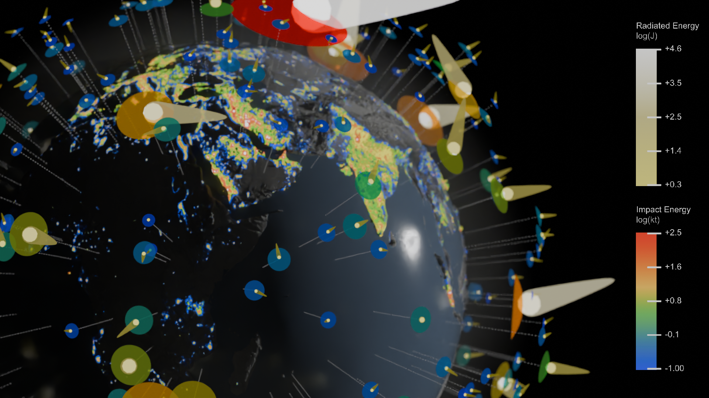
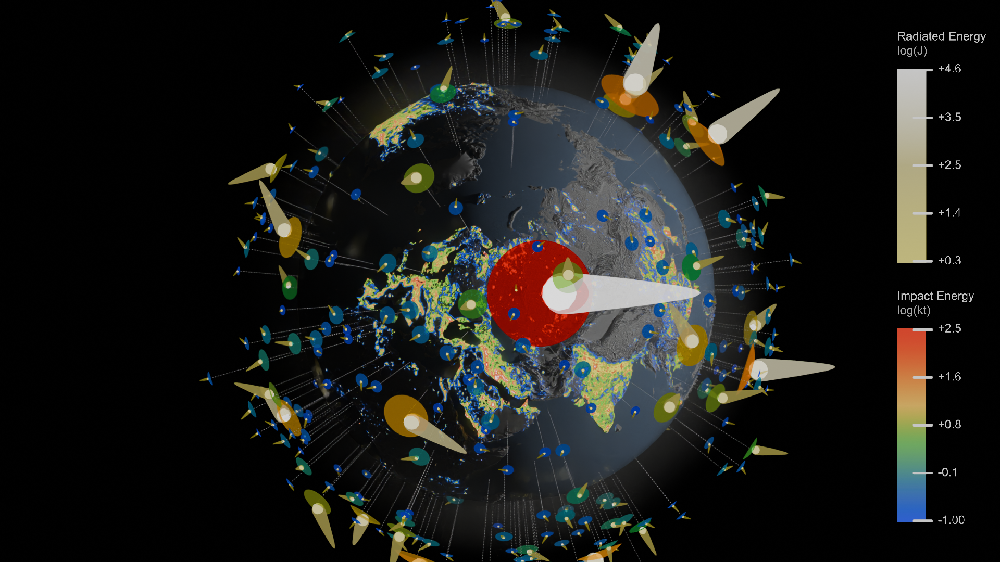

# Blender-based Visualization of NASA JPL CNEOS Fireball Dataset

Blender3D is a CGI tool. Here, we use it for data visualization.

*How to interpet asteroid data:* each asteroid is placed according to where it was detected. The radiated energy (energy released before impace) of the impact is encoded by the color (upper color spectrum), as well as tail length. Meanwhile, the energy released by the impact is encoded by the radius of the circle below the asteroid, as well as the lower color specturm. Notice that both specturms are on log scales.

*How to interpret topography:* topography is emphasized for artistic purposes, and so the viewer can understand which part of the world they are looking at (aligned with asteroid gps coordinates).

*How to interpret light pollution:* light pollution is encoded on top of the topography, using an arbitrary color spectrum where blue is lower light pollution, and red is max light pollution. This gives the viewer references for where the largest cities are, and where to find the best asteroid viewing spots.

## Full Animation:
See `blender/output/orbit.001/output0001-0100.mp4` (large video file).

## Workflow
Use the following blender addon for loading in the CSV file generated by `data/Download And Format CNEOS Fireball Data.ipynb` and then displaying as particle system using geometry nodes:

https://github.com/simonbroggi/blender_spreadsheet_import?tab=readme-ov-file

The blender file in `blender/main.blend` will know how to display the outputs of the notebook. This blender file also knows how to composite in the color spectrums, and shade the area with the topography in the data folder.

## Acknowledgments

A useful demo by CG Figures which deserves credit:

https://www.youtube.com/watch?app=desktop&v=wrLZ6SIE_7c

